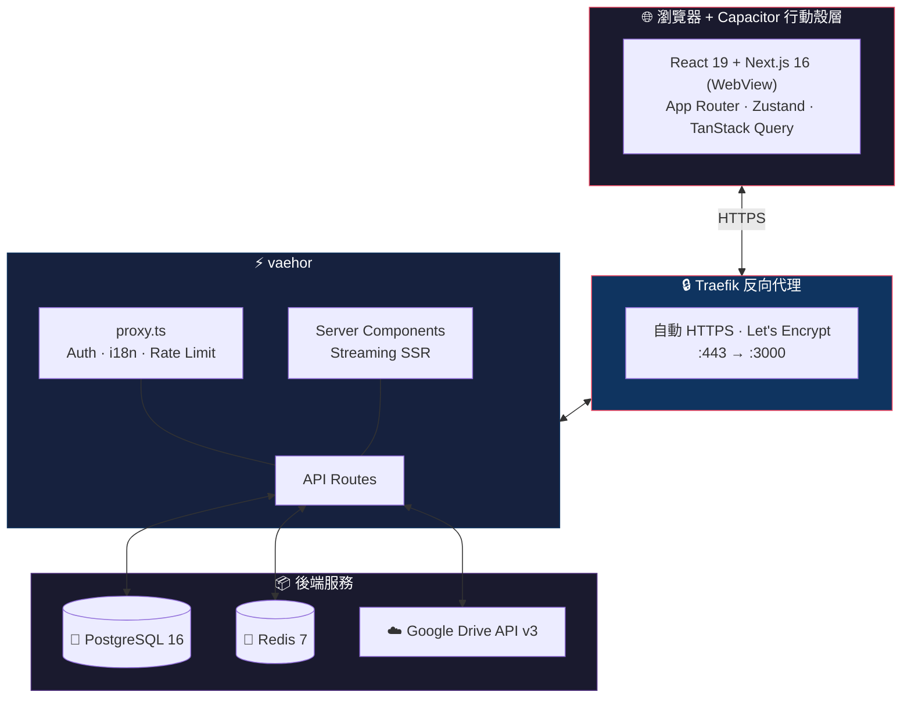

<div align="center">
  <a href="https://github.com/dytsou/vaehor">
    
  </a>

  <h1 align="center">⚡ vaehor</h1>

  <p align="center">
    <strong>自架 Google Drive 瀏覽器、媒體庫與串流服務</strong>
  </p>

  <p align="center">
    把 Google Drive 變成專業的檔案管理、媒體藝廊與串流伺服器。<br>
    <strong>共用雲端硬碟</strong> · <strong>影片串流</strong> · <strong>行動 App</strong> · <strong>分享連結</strong>
  </p>

  <div align="center">
    <a href="https://zee-index.duckdns.org"></a>
    <a href="https://github.com/dytsou/vaehor/issues"></a>
    <a href="https://github.com/dytsou/vaehor/pulls"></a>
  </div>

  <br />

  <div align="center">
    
    
    
    
    
    
    
  </div>
</div>

<p align="center">
  <a href="README.md">English</a> · <strong>繁體中文</strong>
</p>

<br />

---

## 📑 目錄

<details>
<summary>點此展開</summary>

- [📑 目錄](#-目錄)
- [🌟 主要功能](#-主要功能)
  - [⚡ 效能與介面](#-效能與介面)
  - [🎬 媒體與預覽](#-媒體與預覽)
  - [🛡️ 安全與存取控制](#️-安全與存取控制)
  - [🗂️ 雲端硬碟管理](#️-雲端硬碟管理)
  - [🛠️ 管理後台](#️-管理後台)
  - [📱 行動 App（Capacitor）](#-行動-appcapacitor)
- [🛠️ 技術堆疊](#️-技術堆疊)
- [🏗 架構概覽](#-架構概覽)
- [🚀 快速開始](#-快速開始)
  - [先決條件](#先決條件)
  - [🐳 Docker 快速啟動（建議）](#-docker-快速啟動建議)
  - [💻 本機開發](#-本機開發)
- [Google Cloud 設定](#google-cloud-設定)
  - [1. 建立專案](#1-建立專案)
  - [2. 啟用 Google Drive API](#2-啟用-google-drive-api)
  - [3. OAuth 同意畫面](#3-oauth-同意畫面)
  - [4. 建立 OAuth 2.0 憑證](#4-建立-oauth-20-憑證)
  - [5. 連接 Google Drive（二選一）](#5-連接-google-drive二選一)
    - [選項 A — 服務帳戶（建議）](#選項-a--服務帳戶建議)
    - [選項 B — OAuth refresh token（舊路徑）](#選項-b--oauth-refresh-token舊路徑)
- [⚙️ 環境變數](#️-環境變數)
  - [必要變數](#必要變數)
  - [Google Drive 驗證（二選一）](#google-drive-驗證二選一)
  - [資料庫與快取](#資料庫與快取)
  - [選用變數（節錄）](#選用變數節錄)
- [📦 部署指南](#-部署指南)
  - [VPS / DigitalOcean](#vps--digitalocean)
  - [DuckDNS + Traefik 自動 HTTPS](#duckdns--traefik-自動-https)
  - [行動 App（Capacitor）](#行動-appcapacitor)
  - [其他平台](#其他平台)
- [🔐 安全性](#-安全性)
  - [驗證方式](#驗證方式)
  - [角色與權限](#角色與權限)
  - [密碼雜湊（bcrypt）](#密碼雜湊bcrypt)
  - [行動 OAuth（Capacitor）](#行動-oauthcapacitor)
  - [安全標頭](#安全標頭)
- [📖 API 參考](#-api-參考)
- [⌨️ 鍵盤快捷鍵](#️-鍵盤快捷鍵)
- [🌍 國際化（i18n）](#-國際化i18n)
- [📂 專案結構](#-專案結構)
- [🧪 測試](#-測試)
- [⚠️ 疑難排解](#️-疑難排解)
- [🤝 貢獻](#-貢獻)
- [📜 授權](#-授權)
- [🙏 致謝](#-致謝)

</details>

---

## 🌟 主要功能

### ⚡ 效能與介面

| 功能           | 說明                                                               |
| -------------- | ------------------------------------------------------------------ |
| **虛擬化清單** | 以 `@tanstack/react-virtual` 順暢捲動 **上萬個檔案**               |
| **智慧預取**   | 滑過資料夾時預載內容，導覽更即時                                   |
| **多層快取**   | Redis + 記憶體快取加速 API                                         |
| **Turbopack**  | Next.js 16 Turbopack 加速開發建置                                  |
| **PWA**        | 可安裝的 Progressive Web App（殼層／資源快取；Drive 內容仍需網路） |
| **深色／淺色** | 自動偵測主題，亦可手動切換                                         |

### 🎬 媒體與預覽

| 功能                                    | 說明                            |
| --------------------------------------- | ------------------------------- |
| **影片串流**                            | VidStack 播放器、續播、劇院模式 |
| **自動字幕**                            | 自動偵測並載入 `.srt` / `.vtt`  |
| **音訊 Dock**                           | 跨頁面持續播放的音訊列          |
| **圖片藝廊**                            | 瀑布流 + lightbox               |
| **PDF／程式碼／Office／壓縮檔／電子書** | 內建或 Google Viewer 預覽       |

### 🛡️ 安全與存取控制

| 功能               | 說明                                      |
| ------------------ | ----------------------------------------- |
| **角色權限**       | Admin／Editor／User                       |
| **資料夾密碼**     | 遞迴保護，bcrypt 雜湊                     |
| **雙因素驗證**     | 可選 TOTP + QR                            |
| **分享連結**       | JWT、過期、次數上限、防下載、浮水印       |
| **速率限制與 CSP** | API／管理／登入／下載分端點限制與安全標頭 |

### 🗂️ 雲端硬碟管理

| 功能                           | 說明                           |
| ------------------------------ | ------------------------------ |
| **多雲端硬碟**                 | 個人／共用／團隊硬碟統一側欄   |
| **手動硬碟／別名／私人資料夾** | 設定層顯示名稱與隱藏           |
| **我的最愛／拖放／批次操作**   | 釘選、移動、ZIP 下載、批次刪除 |

### 🛠️ 管理後台

分析、活動紀錄、使用者管理、儲存空間監控、快取控制、系統健康、公開上傳連結（File Request）。

### 📱 行動 App（Capacitor）

| 功能             | 說明                                                |
| ---------------- | --------------------------------------------------- |
| **iOS／Android** | `apps/mobile/` 混合殼層（WebView 載入你的自架站台） |
| **原生 OAuth**   | 系統瀏覽器登入 + `vaehor://auth/callback`           |
| **生物辨識**     | 依伺服器選用生物辨識解鎖工作階段                    |
| **原生上傳**     | 檔案選擇／相機橋接既有可續傳上傳 API                |
| **Deep Links**   | 自訂 scheme；可選 Universal／App Links              |

詳見 [部署 → 行動 App](#行動-appcapacitor) 與 [docs/mobile/](docs/mobile/)。

---

## 🛠️ 技術堆疊

| 層級     | 技術                                                        | 用途                                                   |
| -------- | ----------------------------------------------------------- | ------------------------------------------------------ |
| 前端     | Next.js 16 + React 19                                       | App Router、Server Components、串流 SSR                |
| 前端     | Tailwind + Framer Motion／Zustand + TanStack Query          | 樣式與狀態                                             |
| 後端     | Next.js API + `proxy.ts`                                    | REST、auth／i18n／速率限制（Next.js 16 request proxy） |
| 後端     | NextAuth.js v5、Google Drive API v3、Prisma + PostgreSQL 16 | 登入、檔案、資料庫                                     |
| 基礎建設 | Redis 7、Docker + Traefik                                   | 快取、容器、自動 HTTPS                                 |
| 開發     | TypeScript、Vitest、Playwright、Capacitor 7                 | 型別、測試、行動殼層                                   |

---

## 🏗 架構概覽



> **線上展示：** [https://zee-index.duckdns.org](https://zee-index.duckdns.org)

---

## 🚀 快速開始

### 先決條件

| 需求                                                    | 版本         | 必要性        |
| ------------------------------------------------------- | ------------ | ------------- |
| [Docker](https://docs.docker.com/get-docker/) + Compose | 最新         | ✅ 必要       |
| [Git](https://git-scm.com/)                             | 最新         | ✅ 必要       |
| [Node.js](https://nodejs.org/) + pnpm                   | 24–25.x／11+ | 🔶 僅本機開發 |
| Google Cloud 專案                                       | —            | ✅ 必要       |

### 🐳 Docker 快速啟動（建議）

最快方式：一次啟動 **PostgreSQL**、**Redis**、**自動 HTTPS**。

```bash
git clone https://github.com/dytsou/vaehor.git
cd vaehor
cp .env.example .env
nano .env   # 填入憑證（見「環境變數」）
docker compose up -d --build
# 開啟 http://localhost:3000（或你的網域）
# 前往 /setup 完成 Google Drive 設定
```

**常用指令：**

```bash
docker compose logs -f vaehor
docker compose up -d              # .env 變更後重啟
docker compose up -d --build      # 程式碼變更後重建
docker compose down
docker compose down -v            # ⚠️ 連資料一併刪除
```

### 💻 本機開發

```bash
git clone https://github.com/dytsou/vaehor.git
cd vaehor
pnpm install
cp .env.example .env
# 編輯 .env（密鑰與 Google 憑證；本機 POSTGRES_* / REDIS_URL 預設即可）
pnpm deps:up          # Postgres 127.0.0.1:5432 + Redis 127.0.0.1:6379
pnpm prisma migrate deploy
pnpm dev
# http://localhost:3000
```

若 Turbopack 出現 **Read-only file system**（或 `.next` 損壞導致編譯卡住），清快取或改用 Webpack：

```bash
pnpm dev:clean     # 刪除 .next
pnpm dev:fresh     # 清快取後再開 Turbopack
pnpm dev:webpack   # Webpack 後備（ROFS／Turbopack panic）
```

本專案預設關閉 Turbopack 磁碟 FS cache（避免 restore panic）。若機器正常、想加速重複冷啟動，可設 `TURBOPACK_FS_CACHE=1`。

```bash
pnpm deps:up     # 啟動本機 Postgres + Redis
pnpm deps:down   # 停止
pnpm check:all   # 全部檢查
pnpm test        # 單元測試
pnpm test:e2e    # E2E
```

---

## Google Cloud 設定

<details>
<summary><strong>逐步設定 Google Cloud</strong></summary>

### 1. 建立專案

前往 [Google Cloud Console](https://console.cloud.google.com/) 建立或選擇專案。

### 2. 啟用 Google Drive API

**APIs & Services** → **Library** → 搜尋 **Google Drive API** → **Enable**。

### 3. OAuth 同意畫面

1. **OAuth consent screen** → 選 **External**
2. 填寫應用程式名稱與聯絡信箱
3. 加入 scopes：`drive`、`drive.file`、`userinfo.email`、`userinfo.profile`
4. 測試模式請把你的信箱加為測試使用者

### 4. 建立 OAuth 2.0 憑證

1. **Credentials** → **Create Credentials** → **OAuth client ID** → **Web application**
2. **Authorized redirect URIs**（須完全一致，勿加尾隨斜線）：
   - `http://localhost:3000/setup` — `/setup` 取得 refresh token（開發）
   - `http://localhost:3000/api/auth/callback/google` — NextAuth「以 Google 登入」（開發）
   - `https://yourdomain.com/setup` 與 `https://yourdomain.com/api/auth/callback/google`（正式）
   - `vaehor://auth/callback` — Capacitor 行動 Google 登入（見 [行動 App](#行動-appcapacitor)、[docs/mobile/store-release.md](docs/mobile/store-release.md)）
3. 儲存 **Client ID**／**Client Secret**

### 5. 連接 Google Drive（二選一）

#### 選項 A — 服務帳戶（建議）

Drive API 使用 **服務帳戶 JWT**（穩定、不需瀏覽器 refresh token）。若啟用「以 Google 登入」，使用者登入仍用 OAuth client。

1. **IAM & Admin** → **Service Accounts** → 建立 → **Keys** → JSON（或複製 `client_email`／`private_key`）
2. 在 `.env` 設定 `GOOGLE_SERVICE_ACCOUNT_EMAIL`、`GOOGLE_SERVICE_ACCOUNT_KEY`（PEM，換行可寫成 `\n`）、`NEXT_PUBLIC_ROOT_FOLDER_ID`；或用 **`/setup` → Service account**
3. 在 Drive 將根資料夾 **共用** 給服務帳戶信箱（**編輯者**）
4. 若使用 Google 登入，保留 `GOOGLE_CLIENT_ID`／`GOOGLE_CLIENT_SECRET`；僅用服務帳戶存取 Drive 時請將 `GOOGLE_REFRESH_TOKEN` 留空

#### 選項 B — OAuth refresh token（舊路徑）

1. 設定 `GOOGLE_CLIENT_ID`／`GOOGLE_CLIENT_SECRET`
2. `GOOGLE_REFRESH_TOKEN` 留空 → 啟動後到 `/setup` → **OAuth refresh token**
3. 完成流程後把 refresh token 寫入 `.env` 並重啟

若同時設定服務帳戶與 `GOOGLE_REFRESH_TOKEN`，應用程式 **優先使用服務帳戶**。

</details>

---

## ⚙️ 環境變數

### 必要變數

| 變數                                       | 說明                                              | 範例                       |
| ------------------------------------------ | ------------------------------------------------- | -------------------------- |
| `NEXTAUTH_URL`                             | 應用程式 URL                                      | `https://yourdomain.com`   |
| `NEXTAUTH_SECRET`                          | 加密金鑰（至少 32 字元）                          | `openssl rand -base64 32`  |
| `GOOGLE_CLIENT_ID`／`GOOGLE_CLIENT_SECRET` | Google OAuth（NextAuth＋可選 `/setup`）           | —                          |
| `NEXT_PUBLIC_ROOT_FOLDER_ID`               | 根資料夾 ID（使用 SA 時請與 SA 共用此資料夾）     | —                          |
| `ADMIN_EMAILS`                             | 管理員信箱（逗號分隔）                            | `admin@example.com`        |
| `ADMIN_PASSWORD_HASH`                      | 管理員密碼 bcrypt（**正式環境憑證登入必要**）     | `scripts/hash-password.sh` |
| `ADMIN_PASSWORD`                           | 明文密碼 — **僅開發**；有 hash 時憑證登入忽略明文 | —                          |
| `SHARE_SECRET_KEY`                         | 分享連結 JWT 金鑰（至少 32 字元）                 | `openssl rand -base64 32`  |

### Google Drive 驗證（二選一）

| 模式                          | 變數                                                         | 備註                                            |
| ----------------------------- | ------------------------------------------------------------ | ----------------------------------------------- |
| **服務帳戶（建議）**          | `GOOGLE_SERVICE_ACCOUNT_EMAIL`、`GOOGLE_SERVICE_ACCOUNT_KEY` | `GOOGLE_REFRESH_TOKEN` 留空；根資料夾與 SA 共用 |
| **OAuth refresh token（舊）** | `GOOGLE_REFRESH_TOKEN`（來自 `/setup`）                      | 仍需 Client ID／Secret                          |

### 資料庫與快取

| 變數                              | 預設（Docker）                   |
| --------------------------------- | -------------------------------- |
| `POSTGRES_USER`／`PASSWORD`／`DB` | `postgres`／`postgres`／`vaehor` |
| `DATABASE_URL`                    | Docker 內自動產生                |
| `REDIS_URL`                       | `redis://redis:6379`             |

### 選用變數（節錄）

| 變數                                    | 說明                                                             |
| --------------------------------------- | ---------------------------------------------------------------- |
| `SETUP_SECRET`                          | 以 `X-Setup-Secret` 保護 `POST /api/setup/*`（公開首次開機建議） |
| `DOMAIN`                                | Traefik Host／TLS 公開主機名                                     |
| `ACME_EMAIL`                            | Let's Encrypt 註冊信箱                                           |
| `DUCKDNS_DOMAIN`／`DUCKDNS_TOKEN`       | DuckDNS 動態 DNS                                                 |
| `CRON_SECRET`、`TMDB_API_KEY`、SMTP\_\* | 排程、TMDB、郵件                                                 |

> **完整範本：** 複製 [`.env.example`](.env.example)（`cp .env.example .env`）。選用變數以該檔為準。

---

## 📦 部署指南

### VPS / DigitalOcean

適合低資源 VPS（約 1 CPU／1 GB RAM）：

```bash
ssh root@your-server-ip
curl -fsSL https://get.docker.com | sh
adduser zee && usermod -aG docker zee && su - zee
git clone https://github.com/dytsou/vaehor.git
cd vaehor && cp .env.example .env && nano .env
docker compose up -d --build
docker compose ps
```

| 容器       | 記憶體上限 | 典型用量 |
| ---------- | ---------- | -------- |
| `vaehor`   | 512 MB     | ~300 MB  |
| `postgres` | 200 MB     | ~50 MB   |
| `redis`    | 150 MB     | ~20 MB   |
| `traefik`  | 50 MB      | ~10 MB   |

### DuckDNS + Traefik 自動 HTTPS

正式環境 `docker-compose.yml` 使用 **Traefik v3**（80／443）。完整說明見 [docs/deployment.md](docs/deployment.md)。

```bash
DOMAIN="your-subdomain.duckdns.org"
ACME_EMAIL="you@example.com"
DUCKDNS_DOMAIN="your-subdomain"
DUCKDNS_TOKEN="your-duckdns-token"
NEXTAUTH_URL="https://your-subdomain.duckdns.org"
```

```bash
docker compose up -d --build
```

### 行動 App（Capacitor）

`apps/mobile/`：WebView UI、原生 OAuth、生物辨識、上傳、deep links。

**自架＋行動營運檢查清單：**

1. 以公開 HTTPS 提供服務（`DOMAIN` + Traefik；`NEXTAUTH_URL=https://${DOMAIN}`）
2. 在 Google OAuth client 註冊 `vaehor://auth/callback`
3. 首次啟動在 App 內書籤該 origin
4. Universal／App Links：託管 `.well-known` — [docs/mobile/operator-universal-links.md](docs/mobile/operator-universal-links.md)

```bash
pnpm mobile:dev
pnpm mobile:build
pnpm mobile:sync
```

裝置 live reload／商店發行：[docs/mobile/development.md](docs/mobile/development.md)、[docs/mobile/store-release.md](docs/mobile/store-release.md)。

### 其他平台

<details>
<summary><strong>Railway</strong></summary>

建立專案 → 加入 PostgreSQL／Redis → 連接 GitHub → 設定環境變數 → 部署。正式建議仍以 Docker Compose + Traefik 為準。

</details>

<details>
<summary><strong>Render</strong></summary>

Web Service：建置 `pnpm install && pnpm prisma migrate deploy && pnpm build`，啟動 `pnpm start`，並加入 PostgreSQL／Redis。

</details>

---

## 🔐 安全性

### 驗證方式

| 方式             | 說明                     | 設定                                                       |
| ---------------- | ------------------------ | ---------------------------------------------------------- |
| **Google OAuth** | 以 Google 帳號登入       | OAuth 憑證                                                 |
| **管理員密碼**   | Email + 密碼             | `ADMIN_EMAILS` + `ADMIN_PASSWORD_HASH`（正式）；明文僅開發 |
| **雙因素**       | TOTP                     | 管理後台                                                   |
| **行動 OAuth**   | Capacitor 系統瀏覽器登入 | `vaehor://auth/callback` + mobile API                      |

### 角色與權限

| 角色     | 權限                               |
| -------- | ---------------------------------- |
| `ADMIN`  | 完整存取（設定、使用者、所有檔案） |
| `EDITOR` | 管理檔案，不可改系統設定           |
| `USER`   | 標準存取允許的資料夾               |

- **ADMIN**：`POST/DELETE /api/admin/users`
- **EDITOR**：`POST/DELETE /api/admin/editors`

**`ADMIN_EMAILS` 同步：** 驗證時會把 Redis 管理員與 `ADMIN_EMAILS` 對齊——新增會授權、從 env 移除會撤銷。僅透過 Admin API 加入、且從未出現在 `ADMIN_EMAILS` 的管理員會保留。改 `.env` 後請重啟程序／容器。

### 密碼雜湊（bcrypt）

```bash
docker compose exec vaehor sh /app/scripts/hash-password.sh "your-password"
# 將輸出寫入 .env：ADMIN_PASSWORD_HASH=...
```

> **正式環境：** 必須設定 `ADMIN_PASSWORD_HASH`。明文 `ADMIN_PASSWORD` 僅供本機／開發。

### 行動 OAuth（Capacitor）

原生 Google 登入**不**使用內嵌 WebView 登入頁：

1. 註冊 `vaehor://auth/callback`
2. `NEXTAUTH_URL` 與 App 書籤的公開 HTTPS origin 一致
3. 相關路由見 OpenAPI **Mobile** 標籤（[`docs/api/openapi.yaml`](docs/api/openapi.yaml)）
4. CORS 允許 `capacitor://localhost`、`ionic://localhost`；WebView 主流量為同源

### 安全標頭

CSP、HSTS、`X-Frame-Options: DENY`、`nosniff`、Referrer-Policy、Permissions-Policy 等。

---

## 📖 API 參考

API 契約以 **OpenAPI** 為準（由 TypeSpec 產生）：

| 產物        | 路徑                                             |
| ----------- | ------------------------------------------------ |
| Spec 原始碼 | [`docs/api/spec/`](docs/api/spec/)               |
| OpenAPI 3   | [`docs/api/openapi.yaml`](docs/api/openapi.yaml) |
| 營運說明    | [`docs/api/README.md`](docs/api/README.md)       |

```bash
pnpm compile:openapi     # 從 TypeSpec 重新產生 openapi.yaml
pnpm api:docs:redoc      # 用 Redoc 預覽
```

可將 `docs/api/openapi.yaml` 匯入 Swagger UI／Postman。行動 OAuth 路由在 **Mobile** 標籤下。

---

## ⌨️ 鍵盤快捷鍵

| 快捷鍵                                                                | 動作                       |
| --------------------------------------------------------------------- | -------------------------- |
| <kbd>Ctrl</kbd>/<kbd>⌘</kbd> + <kbd>K</kbd>                           | 命令面板                   |
| <kbd>/</kbd>                                                          | 聚焦搜尋                   |
| <kbd>Space</kbd>                                                      | 快速預覽                   |
| <kbd>Ctrl</kbd> + <kbd>A</kbd>                                        | 全選                       |
| <kbd>Delete</kbd>／<kbd>F2</kbd>／<kbd>Enter</kbd>／<kbd>Escape</kbd> | 刪除／重新命名／開啟／關閉 |
| <kbd>G</kbd> 再 <kbd>H</kbd>                                          | 回首頁                     |

---

## 🌍 國際化（i18n）

| 語言     | 代碼    | 狀態 |
| -------- | ------- | ---- |
| 英語     | `en`    | ✅   |
| 印尼語   | `id`    | ✅   |
| 繁體中文 | `zh-TW` | ✅   |

介面以標頭 **Language** 切換；路由帶 locale 前綴（如 `/zh-TW/...`）。新增語言請見英文 [README.md](README.md) 的 i18n 章節。

---

## 📂 專案結構

重點目錄：`app/`（App Router＋API）、`components/`、`lib/`、`messages/`（en／id／zh-TW）、`apps/mobile/`、`deploy/traefik/`、`proxy.ts`、`docker-compose.yml`。完整樹狀圖見 [README.md](README.md#project-structure)。

---

## 🧪 測試

```bash
pnpm test
pnpm test:e2e
```

---

## ⚠️ 疑難排解

<details>
<summary><strong>🔴 容器 unhealthy</strong></summary>

```bash
docker compose logs vaehor --tail 50
# 常見：資料庫未就緒、.env 缺漏、埠號衝突（3000／5432／6379）
```

</details>

<details>
<summary><strong>🔴 登入失敗</strong></summary>

1. `ADMIN_EMAILS` 須與信箱一致（不分大小寫）
2. 正式環境確認 `ADMIN_PASSWORD_HASH` 有效
3. 清除 cookies 後重試；查看 `[Auth]` 日誌

</details>

<details>
<summary><strong>🔴 Google Drive 401／403</strong></summary>

**服務帳戶：** 確認 email／key、根資料夾已與 SA 共用、同時設定時優先 SA。  
**Refresh token：** 確認 token 有效或重跑 `/setup`。

</details>

<details>
<summary><strong>🟡 Prisma client 找不到</strong></summary>

```bash
pnpm exec prisma generate
```

</details>

---

## 🤝 貢獻

歡迎 PR。開發前請執行 `pnpm check:all`，提交訊息遵循 [Conventional Commits](https://www.conventionalcommits.org/)。細節見 [README.md](README.md#contributing)。

---

## 📜 授權

本 fork 採用 **AGPL-3.0**，並須遵守上游強制標示條款：

- **上游：** [ifauzeee/Zee-Index](https://github.com/ifauzeee/Zee-Index) — Copyright (C) 2025 Muhammad Ibnu Fauzi
- **本 fork：** [dytsou/vaehor](https://github.com/dytsou/vaehor) — Copyright (C) 2026 dytsou

- ✅ 可自由使用、修改、散布；允許商業使用
- ⚠️ **強制標示（不得移除或更改）：** 使用者介面須顯示 `© 2025 All rights reserved - Muhammad Ibnu Fauzi`
- ⚠️ 修改後對外提供服務須依 AGPL-3.0 公開原始碼

詳見 [LICENSE](LICENSE)。

---

## 🙏 致謝

本專案（vaehor）基於 [Muhammad Ibnu Fauzi](https://github.com/ifauzeee) 的 [Zee-Index](https://github.com/ifauzeee/Zee-Index)。並感謝 Next.js、VidStack、Radix UI、TanStack、Framer Motion、Zustand、Prisma、Lucide 等開源專案。

---

<div align="center">
  <p><strong>⭐ 若覺得有幫助，請給專案一顆星！</strong></p>
  <p>
    Fork 維護：<a href="https://github.com/dytsou">dytsou</a>
    · 基於 <a href="https://github.com/ifauzeee">Muhammad Ibnu Fauzi</a> / <a href="https://github.com/ifauzeee/Zee-Index">Zee-Index</a>
  </p>
  <p>
    <a href="README.md">English README</a>
    ·
    <a href="https://github.com/dytsou/vaehor">GitHub</a>
    ·
    <a href="https://zee-index.duckdns.org">線上展示</a>
    ·
    <a href="https://github.com/dytsou/vaehor/issues">Issues</a>
  </p>
</div>
